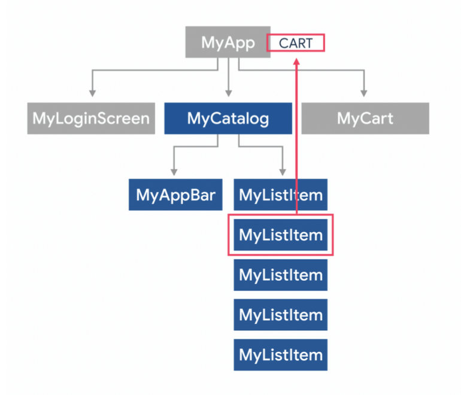

# Guía de Flutter
<p align="center">
  <!-- <a href="https://docs.docker.com/" target="blank"> -->
  </a>
</p>

## Installar flutter.
* [Fluuter](https://docs.flutter.dev/get-started/install)
* [Fvm](https://fvm.app/es/docs/getting_started/installation)
* [Comando](https://medium.com/flutter-españa/instalando-flutter-2-de-manera-segura-con-fvm-36e8ee40c4dd)
```shell
    fvm release
    fvm install VERSION
    fvm use VERSION
    fvm global VERSION
```

# Crear un proyecto.
* Comando para crear un proyecto en flutter
```bash
    flutter create --org <com.compania> <nombre>
    breapp
```

# Flutter Atajos.
* [Flutter - Catálogo de Widgets](https://docs.flutter.dev/development/ui/widgets)

## Widgets
### [Center](https://api.flutter.dev/flutter/widgets/Center-class.html)
* Centra su hijo en relación al widget padre.
```typescript
    Center( child: Text(‘Widget') );
```
### [Align](https://api.flutter.dev/flutter/widgets/Align-class.html)
* Alinea su hijo dentro de si mismo,
* Centra su hijo en relación al widget padre.
```typescript
    Align(
        alignment: Alignment.topRight,
        child: FlutterLogo()
    );
```
### [ConstrainedBox](https://api.flutter.dev/flutter/widgets/ConstrainedBox-class.html)
- Pone reglas adicionales de tamaño, no ser más grande de ciertas dimensiones, o más pequeño de ciertas dimensiones o que tome cierto espacio.
```typescript
    ConstrainedBox(
        constraints: const BoxConstraints.expand(), 
        child: const Card(
            child: Text('Hello World!’) 
        ),
    );
```
### [Container](https://api.flutter.dev/flutter/widgets/Container-class.html)
- Un widget común que combina pintado personalizado, posicionamiento, padding y tamaño en uno sólo.
```typescript
    Center(
        child: Container(
            margin: const EdgeInsets.all(10.0),
            color: Colors.amber[600],
            width: 48.0,
            height: 48.0,
        ), 
    );
```
### [Padding](https://api.flutter.dev/flutter/widgets/Padding-class.html)
- Este widget añade un relleno (padding), que permite al hijo acomodarse a ese nuevo espacio
```typescript
    Padding(
        padding: EdgeInsets.all(16.0),
        child: Text('Hello World!'),
    );
```
### [Tansform](https://api.flutter.dev/flutter/widgets/Transform-class.html)
- Permite realizar transformaciones, rotaciones y demás mutaciones visuales a su child.
```typescript
    Transform.scale(
        scale: 1.2,
        child: Text('Woohoo!'),
    );
```
### [SizedBox](https://api.flutter.dev/flutter/widgets/SizedBox-class.html)
- Una caja con un tamaño especifico, que también fuerza a su child a que respete su tamaño impuesto.
```typescript
    SizedBox(
        width: 200.0,
        height: 300.0,
        child: Container(),
    );
```
## Widget con Múltiples hijos (Children)
### [Column](https://api.flutter.dev/flutter/widgets/Column-class.html)
- Ordena sus hijos de forma vertical, a la vez permite alinearlos internamente en su eje principal o secundario.
```typescript
    Column(
        children: const <Widget>[
            Text('Deliver features faster'),
            Text('Craft beautiful UIs'),
            Expanded(
                child: FittedBox(
                    child: FlutterLogo(),
                ),
            ),
        ], 
    );
```
### [Row](https://api.flutter.dev/flutter/widgets/Row-class.html)
- Similar al column, pero de forma horizontal, también permite alinear sus hijos en el eje principal y secundario.
```typescript
    Row(
        children: const <Widget>[
            FlutterLogo(),
            Text("Hot reload!!"),
            Icon(Icons.sentiment_very_satisfied),
        ]
    );

```
### [Stack](https://api.flutter.dev/flutter/widgets/Stack-class.html)
- Permite colocar sus hijos (Widgets) unos sobre otros y montarse básicamente y a la vez, se pueden alinear y posicionarse en relación al espacio que les da el padre.
```typescript
    Stack(
        children: <Widget>[
            Container(
                width: 100, height: 100, color: Colors.red,
            ), 
            Container(
                width: 90,
                height: 90,
                color: Colors.green,
            ),
        ],
    );
```
### [GridView](https://api.flutter.dev/flutter/widgets/GridView-class.html)
* Un listado de widgets que siguen un patrón repetitivo de celdas de forma vertical.
```typescript
    GridView.count( 
        crossAxisCount: 2, 
        children: <Widget>[
            Container(
                padding: const EdgeInsets.all(8), color: Colors.teal[100],
                child: const Text(“Hi there!”),
            ), 
            Container(
                padding: const EdgeInsets.all(8),
                color: Colors.teal[600],
                child: const Text('Revolution, they...'),
            ), 
        ],
    );
```
### [ListView](https://api.flutter.dev/flutter/widgets/ListView-class.html)
- Es una lista que permite scroll de Widgets que estarán alineados de forma lineal. Es un widget muy común para mostrar listados de widgets.
```typescript
ListView(
    padding: const EdgeInsets.all(8),
    children: <Widget>[
        Container(),
        Container(),
        Container()
    ], 
);
```
### [Wrap](https://api.flutter.dev/flutter/widgets/Wrap-class.html)
- Similar al Column y Row, pero permite ajustar sus hijos de forma vertical y horizontal acorde al número de hijos.
```typescript
    Wrap(
        children: <Widget>[
            Container(), Container(), Container()
        ],
    );
```
### [Table](https://api.flutter.dev/flutter/widgets/Table-class.html)
- Permite ordenar sus hijos en un formato de tabla, filas y columnas de forma estricta.
```typescript
    Table(
        children: <TableRow>[       
            TableRow(
                children: <Widget>[
                   Container(
                        height: 32,
                        color: Colors.green,
                   ),
                    TableCell(
                        child: Container(
                            height: 32,
                            width: 32,
                            color: Colors.red,
                        ),
                        
                    ),
                    Container(
                        height: 64,
                        color: Colors.blue,
                    ), 
                ]    
        ] 
    );  
```
### [SingleChildScrollView](https://api.flutter.dev/flutter/widgets/SingleChildScrollView-class.html)
```typescript
    SingleChildScrollView(
        child: SizedBox(
            height: 4500,
            child: Container(),
        )
    ); 
```

### [CustomScrollView](https://api.flutter.dev/flutter/widgets/CustomScrollView-class.html)
- Similar al widget anterior, pero este está especializado a trabajar con Widgets que tienen el nombre de Slivers, los cuales están estrechamente relacionados a la posición del scroll para realizar su comportamiento visual requerido

## Widgets Comunes
### [AppBar](https://api.flutter.dev/flutter/material/AppBar-class.html)
- Este widget sigue el diseño de Material Design para crear una barra superior de herramientas.


```typescript
    AppBar(
        title: const Text('AppBar Demo'),
        actions: <Widget>[]
    );
```
### [Buttons](https://api.flutter.dev/flutter/material/ElevatedButton-class.html)
- Flutter tiene muchos widgets que generan botones de diferentes tipos y formas.
- Estos son los botones comunes:
```typescript
    ElevatedButton(
        onPressed: null,
        child: const Text('Elevated')
    ),

    FilledButton(
        onPressed: null,
        child: const Text('Filled')
    ),

    FilledButton.tonal(
        onPressed: null,
        child: const Text('Filled Tonal')
    ),

    OutlinedButton(
        onPressed: null,
        child: const Text('Outlined')
    ),
    TextButton(
        onPressed: null,
        child: const Text('Text Button')
    ),

    // Y sus variaciones con íconos
    ElevatedButton.icon(
        onPressed: () {},
        icon: const Icon(Icons.add_a_photo_outlined), 
        label: const Text('Photo')
    )    
```
### [Icon](https://api.flutter.dev/flutter/widgets/Icon-class.html)
- Permite mostrar un ícono de material, se
pueden usar otros iconos con paquetes externos. [Aquí está el listado con buscador](https://fonts.google.com/icons).
```typescript
    Icon(
        Icons.audiotrack, color: Colors.green, size: 30.0,
    );
```
### [Image](https://api.flutter.dev/flutter/widgets/Image-class.html)
- Diseñado para desplegar y mostrar imágenes, puedes obtenerla desde los assets, urls, bitarrays y archivos del dispositivo.
```typescript
    Image(
        image: NetworkImage(
            'https://flutter.github.io/assets-for-api-
            docs/assets/widgets/owl.jpg'
        ),
    );
```
### [Scaffold](https://api.flutter.dev/flutter/material/Scaffold-class.html)
- Implementa un diseño básico de material, y da las bases para colocar un menú lateral, snack-bars, appbars,
bottom sheets y más elementos.
```typescript
    Scaffold(
        appBar: AppBar(
            title: const Text('Sample Code'), 
        ),
        body: const Center(
            child: Text('5 clicks!')
        ), 
        floatingActionButton: FloatingActionButton(
            onPressed: (){},
            child: const Icon(Icons.add), 
        ),
    );
```
### [Text](https://api.flutter.dev/flutter/widgets/Text-class.html)
- Diseñado para mostrar una sola línea de texto con un estilo específico.
```typescript
    Text(
        'Hello, $_name! How are you?',
        textAlign: TextAlign.center,
        overflow: TextOverflow.ellipsis,
        style: const TextStyle(fontWeight: FontWeight.bold),
    );
```
### [Form y FormField](https://api.flutter.dev/flutter/widgets/FormField-class.html)
- Un tipo de contenedor que da el seguimiento a FormFields y permite manejar las validaciones.
- Pueden ver el ejemplo en la [documentación aquí](https://docs.flutter.dev/cookbook/forms/validation).

### [Theme](https://api.flutter.dev/flutter/material/Theme-class.html)
- Permite aplicar un tema de estilos a todos los widgets hijos y sus descendientes.
- Flutter cuenta con cientos de Widgets, es difícil agruparlos todos en una hoja pero les recomiendo esta playlist para conocerlos con ejemplos visuales.
- [Flutter Widget of the Week](https://www.youtube.com/playlist?list=PLjxrf2q8roU23XGwz3Km7sQZFTdB996iG)
- [Catálogo de Widgets agrupados](https://docs.flutter.dev/ui/widgets)

## BuildContext
- Se puede ver como el objeto que tiene la referencia a cada widget en el árbol de Widgets.
<p align="center">
  </a>
</p>

# Flutter CLI
- Esta es la lista de algunos comandos útiles del CLI
```typescript
    |---------------|--------------------|-------------------------------|
    | CMD           | Ejemplo            | Descripción                   |
    |---------------|--------------------|-------------------------------|
    | build         | flutter build      | Construye la aplicación       |
    |               |   <DIRECTORY>      |                               |
    |---------------|--------------------|-------------------------------|
    | channel       | flutter channel    | Enumera o cambia los canales. |
    |               | <CHANNEL_NAME>     |                               |
    |---------------|--------------------|-------------------------------|
    | clean         | flutter clean      | Borra los build/ y .dart_tool |
    |               |                    | / di rectorios                |
    |---------------|--------------------|-------------------------------|
    | create        | flutter create     | Crea un nuevo proyecto        |
    |               |   <DIRECTORY>      |                               |
    |---------------|--------------------|-------------------------------|
    |custom- devices| flutter            |Añade, elimina, lista          |
    |               | custom-devices list|y resetea os dispositivos.     |
    |---------------|--------------------|-------------------------------|
    | devices       |flutter devices -d  |Lista los dispositivos         | 
    |               | <DEVICE_ID>        |conectados                     |
    |---------------|--------------------|-------------------------------|
    | doctor        | flutter doctor     | Herramienta de auto-consulta  |
    |               |                    | y diagnostico                 | 
    |---------------|--------------------|-------------------------------|
    | downgrade     | flutter downgrade  | Hace un downgrade de Flutter  |
    |               |                    | a la versión anterior         |
    |---------------|--------------------|-------------------------------|
    | drive         | flutter drive      | Ejecuta pruebas de Flutter    |
    |               |                    |Driver para el proyecto actual |
    |---------------|--------------------|-------------------------------|
    | emulators     | flutter emulators  |Lista, lanza y crea emuladores |
    |---------------|--------------------|-------------------------------|
    | format        | flutter format     |NO USAR - Formatea el código.  | 
    |               | <dir|dart_file>    |Usar:dart.dev/tools/dart-format|
    |---------------|--------------------|-------------------------------|
    | gen-l10n      | flutter gen-l10n   | Genera las localizations del  |           
    |               | <DIRECTORY>        | proyecto de Flutter.          |
    |---------------|--------------------|-------------------------------| 
    | install       |flutter install -d  | Instala la aplicación en un   |
    |               | <DEVICE_ID>        | dispositivo conectado.        |
    |---------------|--------------------|-------------------------------|
    | logs          | flutter logs       | Muestra los logs de una       |
    |               |                    | aplicación corriendo.         |
    |---------------|--------------------|-------------------------------|
    | run           | flutter run        | Ejecuta la aplicación.        |
    |               | <DART_FILE>        |                               |
    |---------------|--------------------|-------------------------------|
    | screenshot    | flutter screenshot | Toma una fotografía del       |
    |               |                    | dispositivo corriendo.        |
    |---------------|--------------------|-------------------------------|
    | test          | flutter test       |Corre las pruebas de este      |
    |               |DIRECTORY|DART_FILE |paquete Usar este en su lugar  |
    |               |                    | dart.dev/tools/dart-test      |
    |---------------|--------------------|-------------------------------|
    | upgrade       |flutter upgrade     |Actualiza a la siguiente       |
    |               |                    | versión de Flutter            |
    |---------------|--------------------|-------------------------------|
```
## [Navegar a otra pantalla](https://docs.flutter.dev/cookbook/navigation/navigation-basics)
- Hay muchas formas de navegar a diferentes pantallas en Flutter, pero en general esta es la nativa:
```typescript
    onPressed: () { 
        Navigator.push(
            context,
            MaterialPageRoute(
             builder: (context) => const SecondRoute()),
        ); 
    }
```
## Gestores de estado
- Manejar el estado de la aplicación es algo de nivel intermedio, hay muchas formas de manejarlo, desde third-party y first-party.
- [Esta es la lista oficial de opciones según Flutter.dev](https://docs.flutter.dev/development/data-and-backend/state-mgmt/options).
- A continuación una breve descripción sobre los más populares. (En base a experiencia personal)

### [Provider](https://pub.dev/packages/provider):
- Es el [recomendado](https://docs.flutter.dev/development/data-and-backend/state-mgmt/options#provider) por Flutter, en lo personal lo recomiendo para empezar, es robusto, fácil de aprender y usar. (Flutter Favorite)
### [Riverpod](https://pub.dev/packages/riverpod):
- Es otro muy bueno y recomendado, fácilmente testeable.
### [InheritedWidget & InheritedModel](https://api.flutter.dev/flutter/widgets/InheritedWidget-class.html):
- Esta es la opción nativa de Flutter, no dependencias de terceros, algo tediosa a mi parecer, pero es la solución oficial.
### [BLoC / RX y Flutter BLoC + Cubits:](https://pub.dev/packages/flutter_bloc) 
* Es un gestor de estado basado en Streams y Observables, no es el más fácil para empezar, pero da mucho control. A muchas personas no les gusta por que se escribe mucho código. (Flutter Farorite)
### [Get_it:](https://pub.dev/packages/get_it)
* Técnicamente no es un gestor de estado, pero es muy útil para ir puntualmente a un servicio u objeto sin necesidad del BuildContext
### [MobX](https://pub.dev/packages/mobx): 
- Es popular y basado en observables y reacciones. (Flutter Favorite)
### [GetX](https://pub.dev/packages/get): 
- Actualmente el paquete y gestor de estado más popular, hace muchas cosas aparte de manejar estados, tiene navegación, snackbars, internacionalización, temas, validaciones. Es considerado un Framework dentro de Flutter.
- Yo en lo personal NO lo recomiendo para aprender primero ya que oculta conceptos que son necesarios aprender (Como el BuildContext), pero es muy poderoso.
### [Go Router](https://pub.dev/packages/go_router): 
- Manejo de rutas

### Pro Tip:
- Prueben varios gestores de estado, miren cuál es el que más les gusta, sirve y resuelve su necesidad.
- Creen su propia opinion sobre ellos y escuchen a la comunidad, pero al final del día, ustedes tienen la última palabra, NADIE de la comunidad le dará mantenimiento a tu código, por eso deben de saber cuál es mejor para ti.

## Glosario de palabras clave
### Widget
- Inspirado de los componentes de React, los widgets son como piezas de lego que son usadas para construir aplicaciones.

### Child Widget
- Un child widget no es más que cualquier otro Widget Dash: de Flutter, la mayoría de Widgets en Flutter aceptan un child widget, y así se va creando el árbol de Widgets
### 
### Context - BuildContext
- El context es un enlace a la ubicación de widgets en el árbol de Widgets. El “context” es el nombre corto de BuildContext, el cual es pasado de Widget en Widget dejando su marca y posición.
### Estado - Gestor de Estado
- Son los valores actuales de las variables, clases y objetos modificados por la aplicación y el usuario.
### Dash:
- Es el nombre de la mascota de Flutter, es niña y originalmente era para Dart. [Historia aquí](https://docs.flutter.dev/dash)

### Stateless Widget
- Es una pieza de lego que se construye muy rápido y no mantiene el estado por si mismo. Flutter sabe cuando se de be de volver a dibujar, es recomendado que en lugar de crear funciones y métodos que retornan Widget, es mejor crear Clases que extiendan de estos StatelesWidgets.

### Stateful Widget
- Es similar al stateless en cuanto a que es un Widget, pero este permite mantener un estado interno y ciclo de vida como su inicialización y destrucción. Muchos lo tachan de que jamás se deben de usar pero eso no es cierto, los stateful básicamente son el corazón de cualquier animación que suceda.

### HotReload
- Quizá lo más impresionante de Flutter es la capacidad que tiene para mantener el estado en pantalla mientras
cambia la apariencia y estructura de los nuevos widgets en caliente. Es decir, no hay que bajar la aplicación y volverla a subir para ver los cambios reflejados en pantalla.

### Hot Restart - Full-restart
- Es el término que se usa para decir que hay que bajar la aplicación y volverla a subir, puede ser de dos formas, reiniciar toda la aplicación levemente o bajarla completamente y volverla a montar. Este proceso toma más tiempo que el HotReload.

### Main
- Toda aplicación de Dart, tiene una función main que puede ser asíncrona, todo inicia en este punto y desde ahí se desprende toda la aplicación de Flutter.

### Método Build de los Widgets
- Todo widget tiene un método build, el cual es lo que se ejecuta para construirlo, aquí se pueden definir
variables, leer el contexto y definir las condiciones de construcción.
- En caso de Stateful widgets, el build context está disponible de forma global (heredada) dentro de la subclase State.

### CheatSheet - Última versión
- Si esta guía te sirve o sirvió, por favor compártela con todo el mundo, eso nos ayudaría mucho!

